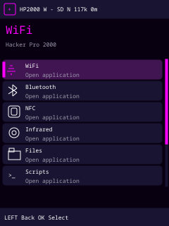
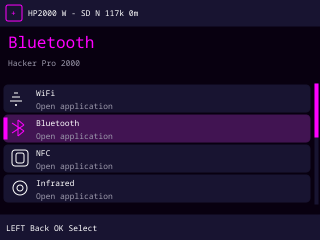
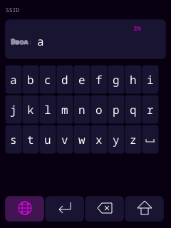
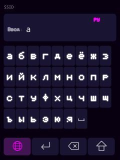
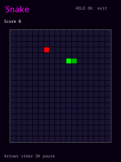
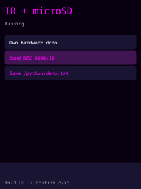

# Hacker Pro 2000 — firmware 2.1.8

Продолжение существующей прошивки для **ESP32 DevKit / ESP32-WROOM-32**, Arduino framework, ST7789 240×320 и пяти кнопок ADKeyboard. Рабочие GPIO и последовательность запуска общих SPI/I2C сохранены. Проект использует собственную архитектуру приложений; Bruce служит референсом UI/UX, код Bruce не скопирован и проект не является его fork.

## Features

**Utils → AudioCtrl (2.1.8):** откройте утилиту, затем выберите **HP2000 HID** в Bluetooth-настройках телефона и выполните pairing. Запустите музыку в приложении телефона. UP/DOWN изменяют громкость, RIGHT/LEFT переключают следующий/предыдущий трек, короткий OK отправляет Play/Pause. Удержание OK сразу возвращает в Utils без отправки Play/Pause. Удержание LEFT не выходит из пульта. Громкость повторяется при удержании UP/DOWN согласно настройке Repeat. Экран показывает подключение и последнюю отправленную команду; состояние воспроизведения с телефона не считывается. После обрыва связи реклама HID запускается снова. Если BLE был выключен до запуска утилиты, он выключается при выходе и возвращает временно отключённый WiFi; ранее включённый BLE остаётся включённым. Используются стандартные [HID Consumer usages USB-IF](https://www.usb.org/sites/default/files/hut1_3_0.pdf); совместимость телефона и музыкального приложения проверяется на железе.

| Приложение | Возможности |
|---|---|
| Launcher | Вертикальные карточки, иконки, крупное название выбранного приложения, status bar, scrollbar и подсказки кнопок |
| WiFi | Асинхронный scanner, BSSID/RSSI/channel/auth/hidden, подключение с экранной клавиатурой, 8 сохранённых сетей, текущая связь, DNS, ping, локальные hosts, TCP ports/client/listener, HTTP GET, обычная тестовая AP, пассивный monitor/PCAP своей подключённой сети, MAC info |
| Bluetooth | Пассивный BLE scanner, имя/address/RSSI/services/manufacturer data, собственный advertiser, ручной HID keyboard и mouse с pairing |
| Utils | AudioCtrl: Bluetooth-пульт для громкости, переключения треков и Play/Pause на телефоне |
| NFC | ISO14443A UID и metadata, NDEF reader/writer Text/URL для writable NTAG213/215/216 и NDEF-форматированных MIFARE Classic 1K, сохранение JSON, просмотр/удаление |
| Infrared | Назначаемые кнопки Remote, 24-key RGB profile и цветовая сетка, NEC editor, raw timings, SD presets и сохранённые сигналы |
| Files | Каталоги, иконки/размеры, страницы по 64 записи, Open/Info/Rename/Delete/Create Directory, порционный text viewer |
| Scripts | Лёгкий `.script` runner, текущая строка, Cancel, ограниченные команды PRINT/BEEP/DELAY/IR_NEC/WIFI_SCAN/NFC_SCAN/OPEN_APP |
| Games | Snake, Minesweeper (первый ход безопасный), Tetris; отдельный игровой экран, выход с подтверждением |
| Python | PikaPython, файлы `/python`, TFT-адаптер `tkinter`, события/состояние кнопок, NEC IR и текстовые файлы microSD |
| Tools | System Info, Hardware Test, I2C scanner, read-only GPIO/ADC monitor, SPI/WiFi diagnostics, heap/largest block, benchmark, Serial Console, reboot |
| Settings | Display, Sound, Input, WiFi, Bluetooth, NFC, IR, Storage, Interface, Boot, Developer, About; сохранение в Preferences/NVS |

Четыре темы: **Bruce-like** по умолчанию, Dark, Light, Green terminal. Диалоги подтверждения, сообщения, прогресс с отменой, текстовый/числовой/hex ввод и toasts имеют общий renderer. Список обновляет только изменившиеся строки и области; `fillScreen()` не вызывается постоянно в loop. SD и PN532 необязательны: boot продолжается, приложение объясняет отсутствие модуля. BLE и WiFi можно выключить независимо.

В **2.1.7**, если перед запуском BLE свободно меньше 75000 bytes internal RAM, прошивка временно выключает WiFi и повторно проверяет память. Экран сообщает `WiFi paused for BLE RAM`. Сохранённая настройка WiFi не меняется: радиомодуль включается обратно после полного выключения BLE; подключение к сети при необходимости выполните через Connect / Saved Networks. Активная AP, сетевая задача или запись пакетов запрещают автоматическое выключение WiFi. При достаточной RAM оба радиомодуля работают вместе. NetworkTools больше не держит idle worker: стек 12 KB и очередь результата создаются только для операции и освобождаются после её завершения.

WiFi utilities предназначены для собственных сетей и устройств. Deauth, floods, jamming, phishing, сбор credentials третьих лиц, ARP poisoning, обход NFC доступа и подбор ключей не реализованы. HID отправляет только явно выбранные пользователем действия; script format не поддерживает скрытые HID payloads.

## Screenshots

Превью ниже получены **из настоящего DisplayManager на host-заглушке TFT**. Геометрия/цвета соответствуют renderer, host заменяет штатный шрифт на monospace. Это не фотографии прошитой платы.










Фотографии реального TFT, NFC writer и BLE pairing можно добавить сюда после стендовой проверки. SVG всех четырёх тем находятся в `docs/screenshots/`.

## Hardware и pinout

Целевая плата — обычный ESP32 с **4 MB flash**, без обязательной PSRAM; ESP32-S3 не является целью. Полная WiFi/BLE прошивка использует factory application partition 3 MB, без OTA.

| Устройство | Сигнал | GPIO |
|---|---|---:|
| Общий SPI | SCK / MISO / MOSI | 18 / 19 / 23 |
| ST7789 | CS / DC / RST | 5 / 27 / 26 |
| microSD | CS | 13 |
| PN532 I2C | SDA / SCL | 21 / 22 |
| ADKeyboard | OUT / VP, ADC1 | 36 |
| Passive buzzer | Signal | 16 |
| IR transmitter | DAT | 17 |

TFT и SD используют отдельные CS, оба устанавливаются HIGH перед SPI.begin. PN532 переключить в I2C, ожидаемый 7-bit address **0x24**. Дополнительные IRQ/RST не нужны: Adafruit PN532 использует polling и sentinel 255. Общая земля, уровни 3.3 V, ADKeyboard питается от 3.3 V. Для IR нужен соответствующий передатчик/драйвер, а не мощный LED напрямую от GPIO.

Подсветка не имеет управляющего GPIO: яркость фиксированная; timeout выключает изображение контроллера, но не питание backlight. Громкость buzzer фиксированная, регулируются частота/длительность. Для tone зарезервирован LEDC channel 6 / timer 3, чтобы UI clicks не меняли частоту PWM IRremote. BatteryManager возвращает Unavailable.

Статусы READY/initialized подтверждают программную инициализацию. Фактическое изображение, клавиши, звук, IR carrier и работу с метками проверяют на стенде.

## Controls

| Действие | Кнопка |
|---|---|
| Предыдущий / следующий пункт | UP / DOWN; удержание повторяет |
| Открыть / подтвердить | короткий OK |
| Назад | короткий LEFT |
| Context/action, если предусмотрен | RIGHT или LONG OK |
| Вернуться в Launcher, остановив активное приложение | LONG LEFT; внутри игр/Python действует только LONG OK + подтверждение |
| Viewer page forward / back | RIGHT / LEFT; на первой странице LEFT возвращает в каталог |
| Grid / экранная клавиатура | четыре направления, OK выбирает ячейку |

Кнопка ввода в приложении открывает отдельную полноэкранную клавиатуру, а не строки меню. Сверху поле «Ввод:», ниже сетка по 9 клавиш. Нижние четыре иконки: глобус (EN → РУ → цифры/символы → EN), Enter (подтвердить и закрыть), Backspace (удалить букву), Shift (нижний/верхний регистр). В русской раскладке 33 буквы, включая ё; в символах — цифры и все печатные ASCII знаки обычной клавиатуры. Пробел обозначен иконкой в сетке. LONG OK также удаляет последнюю букву; LONG LEFT возвращает в launcher без подтверждения. Удаление работает по UTF-8 символам, ограничения протоколов по-прежнему измеряются в байтах. Пароль отображается маской по количеству букв. Для кириллицы добавлены собственные 5×7 glyphs. Удаление файла, NFC запись, запуск скрипта, ручной HID text и reboot требуют подтверждения; исходный выбор — **No**. Первое нажатие после screen timeout только будит экран.

Калибровка старого Keyboard сохранена: LEFT 0–200, UP 300–700, DOWN 900–1500, RIGHT 1600–2300, OK 2500–3200, NONE >3900. Промежутки — UNKNOWN. Debounce 35 ms; после UNKNOWN или смены кнопки без отпускания требуется возвращение в NONE. Короткие OK/LEFT выдаются при отпускании, длинные не создают дополнительного короткого события. Все экраны получают InputEvent, analogRead находится только в input driver.

Status bar показывает SD, WiFi, BLE, NFC и uptime; memory/FPS overlay включается в Developer. Подробные heap и состояния доступны в Tools. После пяти минут бездействия при выключенных радиомодулях и отсутствии задач используется light sleep с timer wakeup 10 ms: резистивная лестница GPIO36 не позволяет одним EXT0 wakeup корректно обработать все кнопки.

## Dependencies

Проверено: **arduino-cli 1.4.1**, **ESP32 core 3.3.12**, следующие библиотеки:

```bash
arduino-cli config add board_manager.additional_urls https://espressif.github.io/arduino-esp32/package_esp32_index.json
arduino-cli core update-index
arduino-cli core install esp32:esp32@3.3.12
arduino-cli lib install "Adafruit GFX Library@1.12.6"
arduino-cli lib install "Adafruit ST7735 and ST7789 Library@1.11.0"
arduino-cli lib install "Adafruit PN532@1.3.4"
arduino-cli lib install "IRremote@4.7.1"
arduino-cli lib install "NimBLE-Arduino@2.5.1"
```

Adafruit BusIO устанавливается зависимостью Adafruit. SPI, Wire, SD, WiFi, Preferences, HTTPClient, FreeRTOS и ICMP ping входят в ESP32 core. Отдельная SD library и тяжёлый JavaScript runtime не нужны. `build_opt.h` задаёт C++17.

## Build / Upload / Serial Monitor

Из корня проекта:

```bash
./scripts/build.sh
```

Скрипт использует FQBN `esp32:esp32:esp32`, PartitionScheme=huge_app и добавляет Git commit в About, если checkout имеет настоящий HEAD; иначе показывает `unversioned`.

Для сохранения `.bin`, bootloader и partition table в `build/esp32.esp32.esp32/`:

```bash
./scripts/build.sh --export-binaries
```

Эквивалентная явная команда:

```bash
arduino-cli compile --fqbn esp32:esp32:esp32 --board-options PartitionScheme=huge_app .
arduino-cli upload -p /dev/ttyUSB0 --fqbn esp32:esp32:esp32 --board-options PartitionScheme=huge_app .
arduino-cli monitor -p /dev/ttyUSB0 --config baudrate=115200
```

Порт уточнить через `arduino-cli board list`. В Arduino IDE: ESP32 Dev Module, Flash Size 4MB, Partition Scheme **Huge APP (3MB No OTA/1MB SPIFFS)**. В корне также находится согласованный `partitions.csv`: factory app 0x10000–0x30FFFF, NVS остаётся по прежнему адресу 0x9000; otadata 0xE000–0xFFFF оставлена для стандартного Arduino boot_app0.bin. Второго application slot нет. Прошивка не использует SPIFFS.

Запрошенная исходная команда `arduino-cli compile --fqbn esp32:esp32:esp32 .` выполняет компиляцию/линковку, но с default board option CLI проверяет предел **1,310,720 bytes**, даже при локальном partitions.csv. Полная версия превышает этот предел; поэтому опция huge_app обязательна. Исходную команду upload также необходимо дополнить той же опцией. Erase all flash включать не нужно: credentials и старые settings остаются в прежней NVS partition. OTA сейчас не поддерживается.

Если стандартный cache недоступен для записи:

```bash
XDG_CACHE_HOME=/tmp/hp2000-cache ./scripts/build.sh
```

## SD filesystem и форматы

SD не форматируется автоматически. При успешном mount создаются:

```text
/
  nfc/
  ir/
    presets/
  scripts/
  python/
  wifi/
  captures/
  logs/
  config/
  apps/
```

Используйте поддерживаемую ESP32 SD карту FAT/FAT32. Настройки и восемь saved networks хранятся в NVS, независимо от SD. Пароли нужны для соединения и хранятся обычными Preferences: шифрование NVS этой конфигурацией не включено. Не публикуйте dump NVS. `/config`, `/apps`, `/wifi` оставлены для будущих пользовательских данных.

NFC metadata в `/nfc/*.json`:

```json
{"uid":"04:A1:B2:C3:D4:E5:F6","uidLength":7,"type":"ISO14443A","timestamp":0}
```

Timestamp — Unix time при доступной синхронизации NTP после WiFi connect, иначе 0. При отсутствии времени имя содержит сохраняемый boot counter, millis и sequence; существующий файл не перезаписывается. UID 4/7 байт поддерживается, SAK/ATQA считываются из полного ответа PN532 и показаны в Tag Info. Classic-handler выбирается для SAK с MIFARE Classic bit либо для совместимой карты с SAK 00 и ATQA 0004; это не доказательство производителя чипа. Manufacturer определяется только из корректного 7-byte UID allocation, без угадывания модели по UID.

IR `.ir` и совместимые старые `.txt`: address/command hex, repeats decimal.

```text
NEC 0000 10 0
```

`/ir/presets/` содержит такие же текстовые presets, **JSON button profiles пока не поддерживаются**. Remote назначения сохраняются в отдельной NVS namespace. RGB profile — распространённый 24-key NEC EF00, команды 00–17 hex; address можно изменить. Он может отличаться от конкретного пульта, проверьте свою модель. Raw файл содержит запятые между длительностями в микросекундах, первая — mark:

```text
9000,4500,560,560,560,1690,560,560,560
```

Carrier выбирается в Raw Sender (30–60 kHz). Максимум 256 timings, каждый 1–20,000 μs, суммарно ≤200,000 μs; файл ≤2 KB. Это пример синтаксиса, а не полный код конкретного пульта. NEC address ≤FFFF, command ≤FF, repeats 0–5. Preset загрузка и назначение сами по себе ничего не передают.

Viewer открывает `.txt`, `.log`, `.json`, `.csv`, `.ir`, `.nfc`, `.script`, читает по 15 строк × 32 символа. JSON показывается как обычный текст без pretty print. Штатный шрифт Adafruit GFX не поддерживает UTF-8, не-ASCII байты отображаются точками; это ограничение отображения, не изменение файла. История назад до 128 страниц. Rename принимает имя в текущем каталоге; Delete удаляет только обычные файлы, каталоги не удаляются. Files имеет страницы по 64 записи; специализированные списки scripts и IR presets показывают первые 64 записи.

Logger: DEBUG/INFO/WARN/ERROR, Serial и буферизованная SD запись в `/logs/system.log`, flush не чаще чем раз в 2 s, rotation после 1 MB в `system.old.log`. Время `[HH:MM:SS]` — uptime. Пароли не логируются.

## NDEF на MIFARE Classic 1K

Прошивка 2.1.5 добавляет **чтение и запись Text/URL на MIFARE Classic 1K**, уже подготовленный телефоном как NDEF-tag. Используйте обычные **NFC → NDEF Reader / NDEF Writer**. Сохраняйте карту у антенны до результата «Classic 1K: NDEF written and verified», затем проверьте текст/ссылку телефоном.

Classic имеет сектора с аутентификацией и блоки по 16 bytes, поэтому NTAG-команды для него не подходят. Поддерживается стандартный MAD1: публичный MAD Key A `A0A1A2A3A4A5`, NFC data Key A `D3F7D3F7D3F7`, корректный CRC каталога, непрерывные NDEF-секторы с NFC AID `03 E1`. Для уже помеченных NDEF-секторов добавлен один fallback на заводской Key A `FFFFFFFFFFFF`, который используют некоторые телефонные formatter-приложения. Другие ключи не перебираются. Используются только секторы, уже выделенные NDEF в MAD. Ввод — до 100 bytes, сообщение может пересекать несколько секторов; capacity проверяется до записи.

Перед первой записью при необходимости выполните **Format NDEF** на телефоне (например, NXP TagWriter) на своей карте. Прошивка **не форматирует карту автоматически**, не изменяет UID, блок 0, MAD, sector trailers, keys или access bits. Карты с другими ключами, Classic 4K/Mini и запись сырых произвольных блоков не поддерживаются. Если телефон пишет raw-данные без NDEF-format, такой формат требует отдельного режима и здесь не используется.

Проверка проходит до изменения карты: чтение MAD/CRC, стандартная аутентификация только секторов, нужных текущему NDEF-сообщению, GPB mapping/read/write flags и access bits. Поэтому закрытый, но не используемый сектор не мешает короткой записи, сделанной телефоном. Если сообщение доходит до закрытого сектора, операция останавливается до его изменения и сообщает номер сектора/блока. Read-only карта читается, запись отклоняется. При записи сначала обнуляется длина NDEF, каждый изменяемый блок проверяется чтением, длина публикуется последней. Отмена/снятие карты посередине может оставить пустой NDEF; автоматического отката нет. Другие приложения карты не перезаписываются. Раскладки с дополнительными proprietary TLV или разрывом NDEF-секторов отклоняются с объяснением.

Формат основан на [NXP MAD AN10787](https://www.nxp.com/docs/en/application-note/AN10787.pdf) и [NXP Classic NDEF AN1305](https://www.nxp.com/docs/en/application-note/AN1305.pdf). Host tests проверяют чтение/запись телефонного MAD1 layout, CRC по независимым контрольным примерам, переходы через блок/сектор, сохранение служебных блоков, read-only/auth/cancel/verification failures. Настоящие PN532 и Classic 1K требуют проверки на плате.

## Games и Python

В Launcher добавлены отдельные **Games** и **Python**. Игры работают без microSD. Во время игры или просмотра запущенного Python-приложения экран не засыпает. **Для выхода удерживайте OK** до диалога, затем выберите **Yes** и нажмите короткий OK. По умолчанию выбран **No**; No или короткий LEFT возвращает в программу, LONG LEFT не закрывает её. Диалог приостанавливает игру/интерпретатор, подтверждение останавливает Python и освобождает его память. Уже поставленная в очередь ИК-передача может завершиться.

| Игра | Управление |
|---|---|
| Snake | Стрелки — направление; короткий OK — пауза/продолжение; после Game Over OK начинает заново |
| Minesweeper | Стрелки — курсор; короткий OK открывает клетку через 300 ms; два коротких OK за 300 ms ставят/убирают флаг. Первый ход и соседние клетки свободны от мин |
| Tetris | LEFT/RIGHT — движение, удержание повторяет; UP — поворот; DOWN — ускорение вниз; OK — мгновенное падение; после Game Over OK начинает заново |

Скопируйте [примеры Python](examples/sd/python/) в **`/python` на microSD**. Вкладка показывает все файлы и подкаталоги с перелистыванием по 64 записи; OK открывает каталог или запускает выбранный файл как Python-код. При запуске любого файла он должен содержать текст Python. Отдельной установки интерпретатора на карту не нужно.

В прошивку встроен **PikaPython v1.12.5**, компактный Python для микроконтроллеров. Это не полный CPython. `import tkinter as tk` предоставляет собственный маленький TFT-адаптер; настольный Tkinter с Tcl/Tk и оконной системой на этой ESP32 не работает. Поддерживаются `Tk.title/bind/after/update/mainloop/destroy`, `Label` и `Button` с `pack/config`, `Canvas.pack/create_rectangle/delete`. `pack()` располагает виджеты вертикально, UP/DOWN выбирают кнопку, OK вызывает её `command`. Canvas поддерживает восемь основных названий цвета и `#RRGGBB`; `delete()` очищает все прямоугольники. `after()` хранит один таймер; новый заменяет предыдущий. `bind()` принимает `<Key>`, `<Up>`, `<Down>`, `<Left>`, `<Right>`, `<Return>`; `event.keysym` содержит `UP/DOWN/LEFT/RIGHT/OK`. Entry, grid, полноценные шрифты, Tcl/Tk и стандартная библиотека CPython не включены. Произвольные сторонние Python-модули с SD не загружаются.

```python
import tkinter as tk
import device
root = tk.Tk()
root.title("My IR remote")
def send():
    device.ir_nec(0x0000, 0x10, 0)
tk.Button(root, text="Send NEC", command=send).pack()
root.mainloop()
```

| API `device` | Результат / назначение |
|---|---|
| `button()` / `pressed()` | Следующее событие / текущая удерживаемая клавиша, строки `UP/DOWN/LEFT/RIGHT/OK` или `""`. Длинные события OK/LEFT в скрипт не передаются |
| `millis()` / `sleep_ms(ms)` | Время и отменяемое ожидание 0–5000 ms |
| `ir_nec(address, command, repeats)` | Поставить NEC в очередь; address 0–65535, command 0–255, repeats 0–5; 1 — принято, 0 — отказ |
| `beep(hz, ms)` | 100–10000 Hz, 1–1000 ms |
| `read_text(path)` | Текст до 2048 bytes; пустая строка при ошибке/слишком большом файле |
| `write_text(path, text)` / `append_text(path, text)` | Запись/добавление до 1024 bytes за вызов; 1/0 — успех/ошибка |
| `listdir(path)` | До 64 имён, разделённых переносами строк, каталог имеет суффикс `/`; ответ до 2048 bytes |
| `mkdir(path)` / `remove(path)` | Создать каталог / удалить обычный файл; 1/0 — успех/ошибка |
| `alive()` / `width()` / `height()` | Состояние GUI и размер области Canvas |

Относительные пути считаются от каталога запуска скрипта, абсолютные — от корня SD; `..` отклоняется. Обычный `open()` не подключён к SD: используйте `device.read_text/write_text/append_text`. `print()` выводит в Serial/Logger и нижнюю строку TFT. Примеры: `control_panel.py` — ИК и файлы, `buttons.py` — события и удержание, `canvas.py` — анимация.

Ограничения: исходник до **4096 bytes**, общий бюджет выделений VM **64 KB**, до 8 вложенных VM-вызовов, 12 виджетов, 24 прямоугольника, 16 событий кнопок в очереди, до 30 минут на запуск. Запуск требует ≥125000 bytes свободного heap и непрерывного блока ≥36000 bytes; стек worker — 32 KB. При нехватке RAM отключите неиспользуемые BLE/WiFi. OOM, ошибка и отмена освобождают все выделения интерпретатора. TFT/SD/IR обслуживает основная задача через очередь; Python не обращается к общему SPI из worker. Передача NEC и microSD требуют соответствующих подключённых модулей.

## Scripts

Скопируйте содержимое `examples/sd/` на карту. Пример `/scripts/hello.script`:

```text
PRINT "Hello"
BEEP 2000 100
DELAY 500
IR_NEC 0x00 0x10 0
WIFI_SCAN
NFC_SCAN
OPEN_APP "Tools"
```

Команды регистрозависимы; строки в кавычках, `#` начинает комментарий вне кавычек. Числа decimal или `0x` hex. OPEN_APP принимает название Launcher приложения и завершает runner; открыть Scripts из скрипта нельзя. Ограничения: 16 KB файл, 160 bytes строка, 256 строк, 60 s на запуск, DELAY ≤5000 ms, BEEP 100–10000 Hz/≤1000 ms, ожидание WiFi/NFC ≤15 s. Cancel и выход останавливают runner и поиск NFC. Уже начатая ограниченная IR передача завершается в worker. Нет циклов, eval, shell или произвольного доступа к памяти.

## Architecture

```text
hacker-pro2000.ino       Firmware.begin / Firmware.update
src/pins.h, config.h    прежняя аппаратная конфигурация
src/core/               App, AppManager, ServiceManager, Logger, Idle/Sleep,
                        Context, Version, disabled RadioModule implementations
src/input/              Keyboard: ADC → InputEvent, debounce/repeat
src/modules/            рабочие TFT-adjacent SD/PN532/IR/WiFi/Buzzer drivers
src/services/           NetworkTools, CaptureService, BLEUtilityService,
                        NDEFCodec, ScriptParser
src/ui/                 ThemeManager, DisplayManager, menu model, UI/dialogs/toasts,
                        independent KeyboardModel и CyrillicFont
src/apps/               отдельные Launcher/WiFi/BLE/NFC/IR/Files/Scripts/
                        Tools/Settings/About/Games/Python приложения
src/games/              логика Snake/Minesweeper/Tetris без Arduino зависимостей
src/python/             C runtime bridge, FreeRTOS worker, компактный tkinter
src/third_party/         vendored PikaPython с MIT license
scripts/build.sh        воспроизводимая full build, optional Git version
examples/sd/            готовые примеры форматов
tests/                  host tests реальных input/UI/renderer/codecs
```

Arduino CLI рекурсивно собирает `src/`. Старый единый Screens switch заменён реестром App. Для нового приложения: наследовать App/MenuApp, реализовать lifecycle и зарегистрировать в Firmware; не менять input/renderer. Драйверы не рисуют меню.

Основной loop: input → idle → services → AppManager → UI/toasts → dirty draw. TFT/SD обслуживает основная задача. NFC/I2C имеет общего worker с mutex, IR — свою очередь, network tools — ограниченную background job, BLE scan — worker. WiFi scan асинхронный. Promiscuous callback только фильтрует/копирует в ограниченную очередь, никаких SD или SPI операций из callback. Logger worker безопасно ставит строки в очередь; flush SD выполняется в основной задаче.

Нет delay(1000) в основном UI. Некоторые вызовы SD и DNS могут ожидать внутри библиотек; DNS выполняется в worker, медленная/неисправная SD может временно задержать UI. Result buffers, очереди, число записей и длительность операций ограничены. String/vector используются для меню по событию, а не создаются постоянно на каждой итерации.

## Ограничения конкретных функций

- Host Scanner: только текущая локальная subnet, максимум 64 последовательных адреса, ICMP probes. Это поиск отвечающих hosts, не полный inventory; hostname/MAC недоступны без дополнительного resolver/ARP API и помечены unavailable.
- Port Scanner: только TCP connect, до 128 портов/запуск, timeout 150 ms/порт. Ping: 4 probes. TCP Client: до 5 s чтения и около 2 KB; Listener ждёт первый client до 15 s и отвечает заранее введённым текстом.
- HTTP Client: только `http://`, тело до 2 KB; HTTPS явно unavailable, поскольку trust store/сертификаты не настроены. Chunked body декодируется HTTPClient.
- Packet Monitor/PCAP: пассивные **management frames только BSSID текущего соединения**, без data frames и без channel hopping. Нужна собственная подключённая сеть. Capture ≤30 s/около 1 MB, snap length 256, PCAP linktype 105 (IEEE802_11), timestamps относительно начала, dropped counter при переполнении очереди. Monitor работает без SD, сохранение требует SD. Это не полный Wireshark radiotap capture.
- BLE: NimBLE экономит память; init отложен до включения, проверяется internal free heap. В 2.1.6 `btClassicInUse()` явно возвращает false: Arduino core 3.3.12 освобождает ненужную память Classic Bluetooth ещё до `setup()` и проверки heap. NimBLE-Arduino 2.5.1 через legacy header регистрирует оба режима, хотя здесь используется только BLE; память BLE остаётся зарезервированной. Нехватка RAM и ошибка запуска stack показываются отдельно; Serial 115200 сообщает internal heap / largest block перед запуском. Выключение останавливает controller и освобождает объекты после завершения scan worker. Scan 4 s, до 20 устройств/4 service UUID/32 bytes manufacturer data. Adv name ≤18 bytes, payload ≤6 bytes. Keyboard typing ASCII ≤128 bytes предполагает US keyboard layout на host; consumer keys и mouse report — ручные действия. Pair/bond с собственным host; совместимость каждого OS надо проверить на плате.
- NDEF reader: Type 2 (до 512 bytes) и MAD1 Classic 1K (до 720 bytes NDEF-area), Text UTF-8, URI, MIME и описание других records. UTF-16, chunked/malformed records отклоняются. Writer NTAG: verified NTAG213/215/216 без static/dynamic locks и password protection, ввод ≤100 bytes/record ≤128 bytes. Проверяет GET_VERSION/CC/locks/AUTH0, пишет только NDEF user pages, сначала обнуляет length TLV, публикует после данных и проверяет чтением. Не изменяет UID/lock/password/config pages. Отключение питания во время записи может оставить пустой/неполный NDEF.
- Serial Console: bounded RX последних 512 bytes и ручная отправка через экранную клавиатуру, не terminal emulator. GPIO Viewer read-only, ограничен используемыми выводами. Benchmark короткий integer workload, не стандартная оценка CPU.

## Future hardware

`RadioModule` и disabled CC1101Module/NRF24Module готовы для расширения. Launcher показывает SubGHz/2.4GHz Radio как Not installed. Библиотеки и GPIO этих модулей не подключены. IR RX отсутствует и не симулируется; позднее добавляется отдельным service/app action. BatteryManager, SleepManager и настройки display подготовлены к будущему battery/backlight hardware.

## Проверка и troubleshooting

```bash
./tests/run.sh
./tests/run-python.sh
./scripts/build.sh
```

Host tests проверяют все ADC 0–4095, bounce, short/long OK и LEFT, repeat, UNKNOWN, millis rollover, NDEF boundaries, script tokenizer, dirty redraw, темы/rotation, dialog No/Yes, keyboard erase/input и Cancel. NFC polling тест проверяет считывание полного ответа RFConfiguration, задержанный ответ метки (>80 ms), отсутствие метки, ограниченный timeout, UID bounds и повреждённые ответы. Games тестирует столкновения/рост Snake, безопасный первый ход/победу Minesweeper и линии/повороты Tetris. Отдельный тест настоящего PikaPython проверяет GUI callbacks, API устройств, три примера SD, отмену бесконечного цикла, OOM/error recovery, ограничение рекурсии и повторные запуски. Это host-тесты с подменой аппаратного backend, не электрическая проверка. Baseline и полная версия реально собраны ESP32 toolchain; результаты и стендовый checklist находятся в [docs/verification.md](docs/verification.md).

| Симптом | Проверка |
|---|---|
| Sketch too big | Укажите PartitionScheme=huge_app; target flash 4 MB, не default 1.3 MB application |
| Permission denied в cache | XDG_CACHE_HOME=/tmp/hp2000-cache; исходники остаются в этом проекте |
| SD unavailable | FAT/FAT32, CS13, общий GND, MISO19, питание; после подключения карты перезапустить устройство |
| Waiting for tag… | Используйте BIN 2.1.3: полный ответ RFConfiguration считывается, поиск ждёт до 500 ms на фазу обмена, разрешены 2 повтора активации. NFC → Scan ищет ISO14443A с UID 4/7 bytes; диагностика инициализации в Serial 115200 |
| PN532 not detected | I2C switch, SDA21/SCL22, I2C Scanner должен видеть 0x24 |
| NDEF write rejected | NTAG: unlocked/protection off. Classic 1K: сначала NDEF-format телефоном, стандартные NFC ключи/MAD1, writable NDEF-секторы; сообщение объясняет конкретный отказ |
| IR не управляет прибором | Собственный address/command/profile, передатчик/драйвер и carrier; RX нет |
| BLE init failed | Memory Monitor, выключить ненужные radios/задачи, retry; pairing удалить на host и повторить |
| Password/connect failed | Authentication, signal, saved credentials; connection timeout 15 s |
| Мерцание/задержки | Debug/FPS, состояние SD; normal dirty rows не очищают экран целиком |
| Экран выключен, подсветка горит | BL GPIO не подключён; sleep выключает изображение, кнопка будит |

Не запускалась загрузка на плату: прежнее железо было подтверждено пользователем, новые функции требуют проверки TFT/SD concurrency, NFC write/readback, BLE pairing/HID, WiFi connect/AP/PCAP и совместного IR/buzzer на стенде. Перед экспериментом с writer используйте собственную тестовую метку.

## Credits / references

UI/UX inspired by open-source portable multitool firmware such as Bruce. Hacker Pro 2000 использует собственные приложения и renderer.

PikaPython vendored из [v1.12.5](https://github.com/pikasTech/PikaPython/tree/v1.12.5), MIT; происхождение и изменения описаны в `src/third_party/pikapython/README.md`.

Primary references: [Bruce UI](https://wiki.bruce.computer/controlling-device/user-interface/), [Arduino sketch layout](https://docs.arduino.cc/arduino-cli/sketch-specification/), [NimBLE-Arduino](https://github.com/h2zero/NimBLE-Arduino), [Adafruit PN532](https://github.com/adafruit/Adafruit-PN532), [NTAG213/215/216 datasheet](https://www.nxp.com/docs/en/data-sheet/NTAG213_215_216.pdf), [IRremote](https://github.com/Arduino-IRremote/Arduino-IRremote).
